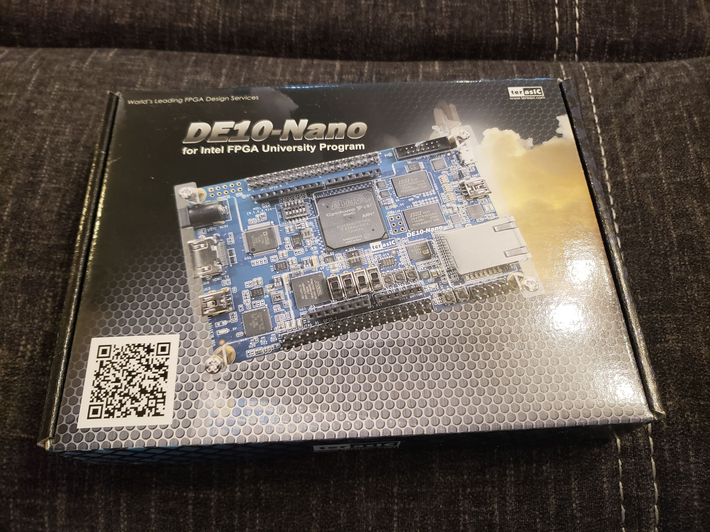
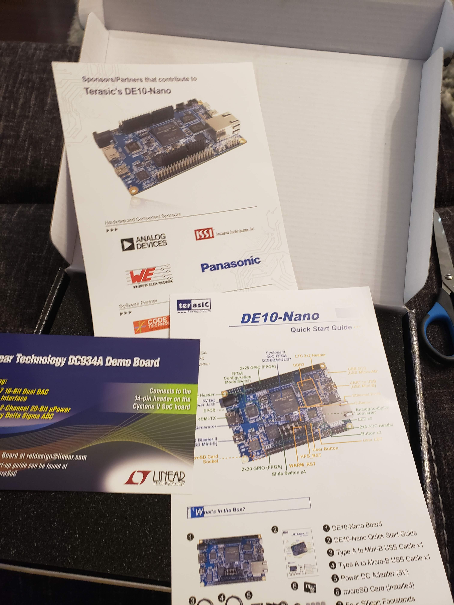

##### *April 29, 2020*

Hello and welcome to my blog! This is my first blog post and I'm really excited to be documenting my journey of exploring lots of 
tech. 

My exams ended on April 22, and since then I've been thinking about what cool projects I'll want to work on over the summer. I only 
have a week off before I start my remote internship at Amazon on May 4. 

### ProjectBudget

First I thought I'd be working on a project I've been meaning to complete for a while, called "ProjectBudget". It's a simple desktop app 
where you can enter your income and expenses information, particularly the big ones that repeat like rent/bills/salary, and the app will
draw a graph that'll show you how much money you'll have in any given time in the future. I know there probably exist a bunch of apps 
like this, but I wanted a simple one with minimal functionality, and one that stores data locally. I started building it using Python and the 
PyQt framework. I'm choosing not to use any other frameworks such as Django because I only need to do minimal database stuff and I don't need
the full functionality of Django. 

You can find the repo of ProjectBudget on [GitHub](https://github.com/AreebaAziz/ProjectBudget). As of today (April 29, 2020), it is incomplete.

### FPGA Development

The other thing I really wanted to get into is FPGA development! I took 2 courses where we developed on FPGAs, but I won't be taking any more
courses on it. I didn't want my FPGA journey to end with classes, so I decided to look into doing some FPGA stuff as a hobby.

The first step was to figure out what board I want, and if there even is one that is affordable. While I was searching, I found a Reddit
community [r/FPGA](https://www.reddit.com/r/FPGA/) where people who work with FPGAs - either as a hobby or for professional work - come together and talk about FPGA things!
There are multiple posts on that subreddit that talk specifically about the first board you should get. 

After lots of research I chose to get the Terasic DE10-Nano board that has a Cyclone V FPGA, an ARM processor, and a bunch of peripherals. 
I chose this one because I could use Quartus and ModelSim with it, and I've used Quartus before in my classes so I wanted to stick with what
I'm familiar with. I bought the board from digikey and it will arrive tomorrow! Super excited to play around with it. 

The next step was to figure out what my first projects would be on the FPGA. I had no idea where to even begin because this is still a relatively
new field and there's not as many resources online for beginners - at least not as many as there are for regular programming. So I decided to 
email my professor from my digital circuits class, [Dr. Nicola Nicolici](https://www.ece.mcmaster.ca/~nicola/), and I asked him if he can provide any tips and guidance regarding how 
I should start with my FPGA journey. Dr. Nicolici is AWESOME! He immediately replied asking me if I'm available for a call so we can communicate
better about what my goals are for the summer, etc. I had the call with him on Sunday, it was a 35 minute call and I'm so grateful of him in 
general for being so supportive when he had absolutely no obligation to. 

Basically, Dr. Nicolici gave me the wonderful idea of taking labs 3-5 from our digital circuits class and porting it to the DE10-Nano board. 
These labs are pretty advanced and were done in another FPGA board, I don't remember which one. He said porting the labs to my board can definitely
be done, and it's a great way for me to learn about my board and have a nice refresher on what I did in my digital circuits class. He said I will
run into an issue with the UART because in our class's FPGA board, the UART was connected directly to the FPGA, however on the DE10-Nano board
the UART is connected to the HPS (Hard Processing System, aka the ARM processor). So I'd have to find a way for the HPS to transfer the UART data
to the FPGA, which means I'll have to go beyond what I learned in my class and learn how to work with an ARM processor on the low level. 

He also said that since I'll have to work with the HPS, I should be familiar with working with ARM processors (i.e. compiling images for the 
processor, writing code to run on the processor, etc). He advised I use a different board with just an ARM processor for learning how to work
with the processor because if I only used the DE10-Nano it'd be more complicated since that board also has an FPGA. He mentioned that the 
Raspberry Pi's processor is ARM based! And I have a Raspberry Pi 3 Model B so that's perfect!

So I decided to open my box of Raspberry Pi stuff for the first time in months. All I ever did on my Pi was boot the default Raspbian OS.. and
that's pretty much it. This time though I wanted to see how to program the Pi to turn on some LEDs through its GPIO pins. 

I took some notes while I was looking into the Pi and the Nano, which are summarized below. 

#### Raspberry Pi Specs

- Raspberry Pi 3 Model B 
- ARM Cortex-A53 Broadcom BCM2837 CPU (64-bit) (quadcore)
- ISA: ARMv8-A
- Raspbian OS, debian-based 
- 1 GB RAM
- 1.2 GHz clock speed
- on-board WiFi, Bluetooth
- 2x20 GPIO pin headers

#### My Breadboard Setup
This was to play with the Pi, I wanted to see how to program GPIO pins to be
on and off. 

The physical set up was as such:

- 4 red LEDs, 1 green LED
- the green LED positive end was connected to the Pi's 5V pin
- the green and red LEDs negative end connected to the Pi GND pin
- the positive ends of the 4 red LEDs were connected as such:
	- GPIO 4 - LED 0
	- GPIO 17 - LED 1
	- GPIO 27 - LED 2
	- GPIO 22 - LED 3

I booted the Raspberry Pi which already had the Raspbian OS I set up long
ago. I looked up how we can control the GPIO pins, and turns out it's a lot easier than I thought. Raspbian comes with handy commands such as ``raspi-gpio`` which you can use to debug the GPIO pins (get and set individual values). 

To set the GPIO 4 pin to high and thus make my LED 0 turn on, I ran this: ``sudo raspi-gpio set 4 op; sudo raspi-gpio set 4 dh``. The first command is to set the GPIO pin 4 to an OUTPUT value (vs INPUT), and the second command is to set the pin 4 to HIGH. 

I repeated those commands for the other 3 LED pins and yeah. 

This was pretty straightforward. However I want to be able to control the GPIO in a lower-level than the nice interface that Raspbian provides. I looked up how we can do that, and apparently there's a C library called ``libgpiod`` which is the best way to control the LEDs. I read that there are other libraries you can use that modify the registers directly on the Pi in order to manipulate the GPIO, however it seems that that is a bad practice method because we are accessing kernel level things directly which we shouldn't do. We should access these low-level registers etc through an interface that the kernel provides to the user space, which for the case of GPIO on ARM-based processors, is ``libgpiod``. 

I was also reading about cross-compilation tools for compiling firmware images. I used buildroot during my internship at Arcturus, but I want to try out yocto now. I think when I get my DE10-Nano board, I will probably use yocto to create a basic linux image that will run on the ARM processor. I could then use yocto to further customize the image to add capabilities. 

To communicate with the Nano board (the HPS side), I can use a serial monitor. So I'll need to get a serial communication client on my Ubuntu PC (during my internship I used putty on a Windows machine). To send files to the HPS, such as code or executable files, I'll need to first cross-compile on my PC for the Nano broadcom processor, and then send it using ssh or something similar. To do this I'll need two ethernet cables: 1 cable to connect my PC to my home router, and another cable to connect my router to the Nano board. Then the board and my PC will be on the same LAN and I could then transfer files to the board. 

My goals in terms of FPGA+HPS development for the rest of the summer are:

- port labs 3, 4, 5 from my digital circuits course over to the DE10-Nano board
- the goal above seems like it would take all summer because I only really have evenings and weekends since I'll be working full time with Amazon. I don't know how much free time I'll have yet, or how much overtime I'll do (not because I have to do overtime, but because I'll probably be super invested in my Amazon projects that I'll want to spend a lot of time on them). 

### Personal Website

The other thing I did this week is revamp my personal website. Before the revamp, my personal website was a single page simple website
with just my name written animated as if it was being written in a terminal, and some links for my contact information.

I wanted to start
documenting the stuff I do on the side (the tech projects), so I decided to write a "blog post" every week where I document what I did
that week and what I learned. Right now the main reason I'm doing this is so I can keep everything I am learning/doing in one place, so I can
remember little things in the future. I know once I get my DE10-Nano board I'll be learning a lot of new things and I want to keep all my notes
somewhere accessible by me and by others who are also interested in getting into hobby FPGA development. 

I revamped my website using a template I found from w3schools. It was a basic 1 page parallex template - just what I needed. I used my sister's
original artwork as the backgrounds because I think they're really pretty! In the end my revamp of the website turned out to look really artsy..
perhaps a bit too artsy for someone in software engineering? Usually when I see other developer's personal websites, they're all super cool
with fancy CSS/JS and the themes are all very tech-y and they all look very good. I really like how my website turned out, even if it looks
too artsy. Because this website is *my* personal space. There are no rules here; I can express myself the way I want to. For someone seeking a more 
professional portfolio, check out my [LinkedIn](https://www.linkedin.com/in/areeba-aziz/) or [resume](../../pdf/Resume_11.pdf)! But I hope to use this website to just be me. And to share my experiences of exploring cool tech projects! 
 

##### *May 1, 2020*

I got my DE10-Nano board!!!! I'm so excited!! 

When I opened the box, the first things I see are a few guides:

And finally... the actual board!!! It's so pretty and it can fit on my hand! Very cool!

Aaand to add to my collection of hobby electronics.. I have a little corner in the living room where I keep all my 
boxes of electronics since I'm working with them a lot recently. 

ALRIGHT so now we dig in. The Nano board package comes with a handy-dandy Quick Start Guide detailing step by step instructions 
on how to get started with the board. By the end of following these instructions, we'll see an HTML web page generated by the Nano on our PC, 
called start.html. 

Something to note is that the MicroSD card comes already installed on the board in the MicroSD socket, and the card has a linux OS installed. 
So, to start off with you don't even need to worry about creating an image for the HPS! You just follow the quick start instructions and
go from there. 

