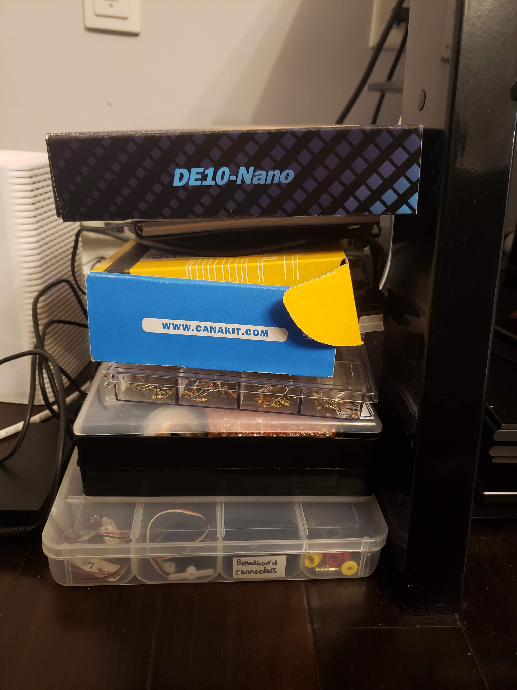
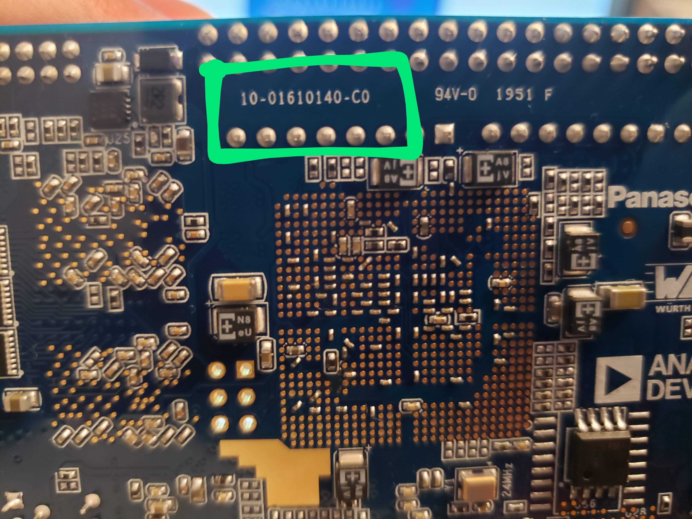
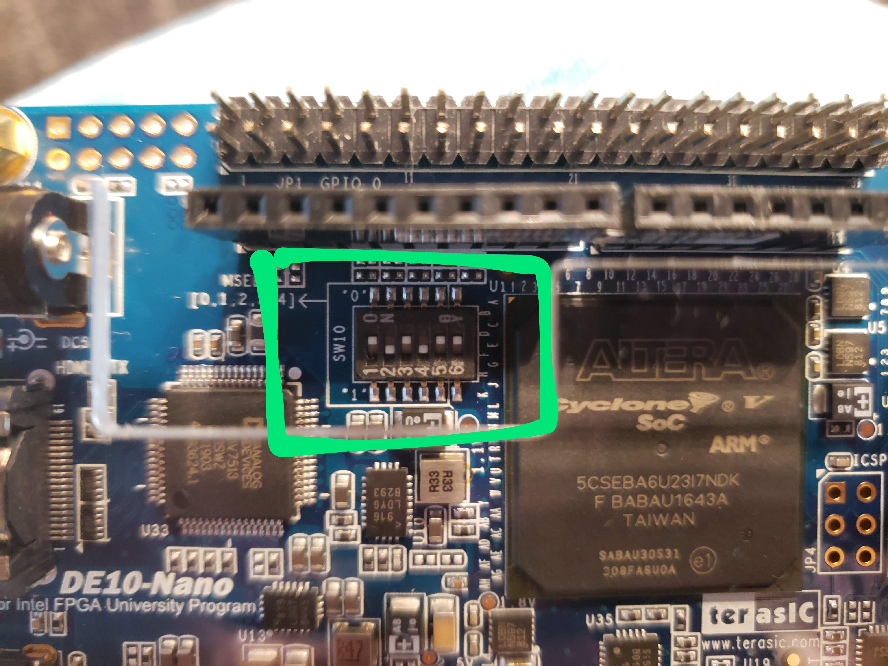
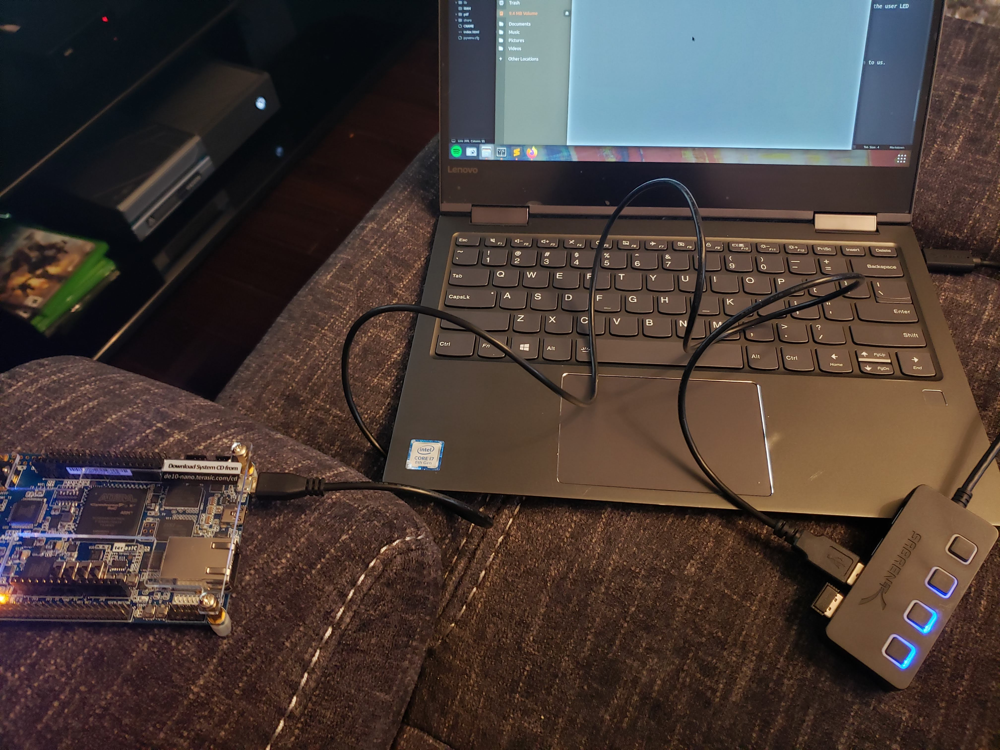
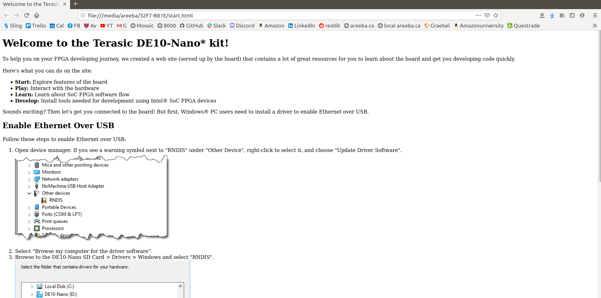

 

##### *April 29, 2020*

Hello and welcome to my blog! This is my first blog post and I'm really excited to be documenting my journey of exploring lots of 
tech. 

My exams ended on April 22, and since then I've been thinking about what cool projects I'll want to work on over the summer. I only 
have a week off before I start my remote internship at Amazon on May 4. 

 

### ProjectBudget

First I thought I'd be working on a project I've been meaning to complete for a while, called "ProjectBudget". It's a simple desktop app 
where you can enter your income and expenses information, particularly the big ones that repeat like rent/bills/salary, and the app will
draw a graph that'll show you how much money you'll have in any given time in the future. I know there probably exist a bunch of apps 
like this, but I wanted a simple one with minimal functionality, and one that stores data locally. I started building it using Python and the 
PyQt framework. I'm choosing not to use any other frameworks such as Django because I only need to do minimal database stuff and I don't need
the full functionality of Django. 

You can find the repo of ProjectBudget on [GitHub](https://github.com/AreebaAziz/ProjectBudget). As of today (April 29, 2020), it is incomplete.

 

### FPGA Development

The other thing I really wanted to get into is FPGA development! I took 2 courses where we developed on FPGAs, but I won't be taking any more
courses on it. I didn't want my FPGA journey to end with classes, so I decided to look into doing some FPGA stuff as a hobby.

The first step was to figure out what board I want, and if there even is one that is affordable. While I was searching, I found a Reddit
community [r/FPGA](https://www.reddit.com/r/FPGA/) where people who work with FPGAs - either as a hobby or for professional work - come together and talk about FPGA things!
There are multiple posts on that subreddit that talk specifically about the first board you should get. 

After lots of research I chose to get the [Terasic DE10-Nano board](https://www.terasic.com.tw/cgi-bin/page/archive.pl?Language=English&CategoryNo=205&No=1046&PartNo=1) that has a Cyclone V FPGA, an ARM processor, and a bunch of peripherals. 
I chose this one because I could use Quartus and ModelSim with it, and I've used Quartus before in my classes so I wanted to stick with what
I'm familiar with. I bought the board from [Digi-Key](https://www.digikey.ca/products/en/development-boards-kits-programmers/evaluation-boards-embedded-complex-logic-fpga-cpld/796?k=de10-nano) and it will arrive tomorrow! Super excited to play around with it. 

The next step was to figure out what my first projects would be on the FPGA. I had no idea where to even begin because this is still a relatively
new field and there's not as many resources online for beginners - at least not as many as there are for regular programming. So I decided to 
email my professor from my digital circuits class, [Dr. Nicola Nicolici](https://www.ece.mcmaster.ca/~nicola/), and I asked him if he can provide any tips and guidance regarding how 
I should start with my FPGA journey. Dr. Nicolici is AWESOME! He immediately replied asking me if I'm available for a call so we can communicate
better about what my goals are for the summer, etc. I had the call with him on Sunday, it was a 35 minute call and I'm so grateful of him in 
general for being so supportive when he had absolutely no obligation to. 

Basically, Dr. Nicolici gave me the wonderful idea of taking labs 3-5 from our digital circuits class and porting it to the DE10-Nano board. 
These labs are pretty advanced and were done in another FPGA board, I don't remember which one. He said porting the labs to my board can definitely
be done, and it's a great way for me to learn about my board and have a nice refresher on what I did in my digital circuits class. He said I will
run into an issue with the UART because in our class's FPGA board, the UART was connected directly to the FPGA, however on the DE10-Nano board
the UART is connected to the HPS (Hard Processing System, aka the ARM processor). So I'd have to find a way for the HPS to transfer the UART data
to the FPGA, which means I'll have to go beyond what I learned in my class and learn how to work with an ARM processor on the low level. 

He also said that since I'll have to work with the HPS, I should be familiar with working with ARM processors (i.e. compiling images for the 
processor, writing code to run on the processor, etc). He advised I use a different board with just an ARM processor for learning how to work
with the processor because if I only used the DE10-Nano it'd be more complicated since that board also has an FPGA. He mentioned that the 
Raspberry Pi's processor is ARM based! And I have a Raspberry Pi 3 Model B so that's perfect!

So I decided to open my box of Raspberry Pi stuff for the first time in months. All I ever did on my Pi was boot the default Raspbian OS.. and
that's pretty much it. This time though I wanted to see how to program the Pi to turn on some LEDs through its GPIO pins. 

I took some notes while I was looking into the Pi and the Nano, which are summarized below. 

#### Raspberry Pi Specs

- Raspberry Pi 3 Model B 
- ARM Cortex-A53 Broadcom BCM2837 CPU (64-bit) (quadcore)
- ISA: ARMv8-A
- Raspbian OS, debian-based 
- 1 GB RAM
- 1.2 GHz clock speed
- on-board WiFi, Bluetooth
- 2x20 GPIO pin headers

#### My Breadboard Setup
This was to play with the Pi, I wanted to see how to program GPIO pins to be
on and off. 

The physical set up was as such:

- 4 red LEDs, 1 green LED
- the green LED positive end was connected to the Pi's 5V pin
- the green and red LEDs negative end connected to the Pi GND pin
- the positive ends of the 4 red LEDs were connected as such:
	- GPIO 4 - LED 0
	- GPIO 17 - LED 1
	- GPIO 27 - LED 2
	- GPIO 22 - LED 3

I booted the Raspberry Pi which already had the Raspbian OS I set up long
ago. I looked up how we can control the GPIO pins, and turns out it's a lot easier than I thought. Raspbian comes with handy commands such as ``raspi-gpio`` which you can use to debug the GPIO pins (get and set individual values). 

To set the GPIO 4 pin to high and thus make my LED 0 turn on, I ran this: ``sudo raspi-gpio set 4 op; sudo raspi-gpio set 4 dh``. The first command is to set the GPIO pin 4 to an OUTPUT value (vs INPUT), and the second command is to set the pin 4 to HIGH. 

I repeated those commands for the other 3 LED pins and yeah. 

This was pretty straightforward. However I want to be able to control the GPIO in a lower-level than the nice interface that Raspbian provides. I looked up how we can do that, and apparently there's a C library called ``libgpiod`` which is the best way to control the LEDs. I read that there are other libraries you can use that modify the registers directly on the Pi in order to manipulate the GPIO, however it seems that that is a bad practice method because we are accessing kernel level things directly which we shouldn't do. We should access these low-level registers etc through an interface that the kernel provides to the user space, which for the case of GPIO on ARM-based processors, is ``libgpiod``. 

I was also reading about cross-compilation tools for compiling firmware images. I used buildroot during my internship at Arcturus, but I want to try out yocto now. I think when I get my DE10-Nano board, I will probably use yocto to create a basic linux image that will run on the ARM processor. I could then use yocto to further customize the image to add capabilities. 

To communicate with the Nano board (the HPS side), I can use a serial monitor. So I'll need to get a serial communication client on my Ubuntu PC (during my internship I used putty on a Windows machine). To send files to the HPS, such as code or executable files, I'll need to first cross-compile on my PC for the Nano broadcom processor, and then send it using ssh or something similar. To do this I'll need two ethernet cables: 1 cable to connect my PC to my home router, and another cable to connect my router to the Nano board. Then the board and my PC will be on the same LAN and I could then transfer files to the board. 

My goals in terms of FPGA+HPS development for the rest of the summer are:

- port labs 3, 4, 5 from my digital circuits course over to the DE10-Nano board
- the goal above seems like it would take all summer because I only really have evenings and weekends since I'll be working full time with Amazon. I don't know how much free time I'll have yet, or how much overtime I'll do (not because I have to do overtime, but because I'll probably be super invested in my Amazon projects that I'll want to spend a lot of time on them). 

 

### Personal Website

The other thing I did this week is revamp my personal website. Before the revamp, my personal website was a single page simple website
with just my name written animated as if it was being written in a terminal, and some links for my contact information.


I wanted to start
documenting the stuff I do on the side (the tech projects), so I decided to write a "blog post" every week where I document what I did
that week and what I learned. Right now the main reason I'm doing this is so I can keep everything I am learning/doing in one place, so I can
remember little things in the future. I know once I get my DE10-Nano board I'll be learning a lot of new things and I want to keep all my notes
somewhere accessible by me and by others who are also interested in getting into hobby FPGA development. 

I revamped my website using a template I found from w3schools. It was a basic 1 page parallex template - just what I needed. I used my sister's
original artwork as the backgrounds because I think they're really pretty! In the end my revamp of the website turned out to look really artsy..
perhaps a bit too artsy for someone in software engineering? Usually when I see other developer's personal websites, they're all super cool
with fancy CSS/JS and the themes are all very tech-y and they all look very good. I really like how my website turned out, even if it looks
too artsy. Because this website is *my* personal space. There are no rules here; I can express myself the way I want to. For someone seeking a more 
professional portfolio, check out my [LinkedIn](https://www.linkedin.com/in/areeba-aziz/) or [resume](../../pdf/Resume_11.pdf)! But I hope to use this website to just be me. And to share my experiences of exploring cool tech projects! 
 
 

##### *May 1, 2020*

### Getting Started with the DE10-Nano

I got my DE10-Nano board!!!! I'm so excited!! 


When I opened the box, the first things I see are a few guides:


And finally... the actual board!!! It's so pretty and it can fit on my hand! Very cool!


Aaand to add to my collection of hobby electronics.. I have a little corner in the living room where I keep all my 
boxes of electronics since I'm working with them a lot recently. 



ALRIGHT so now we dig in. The Nano board package comes with a handy-dandy Quick Start Guide detailing step by step instructions 
on how to get started with the board. By the end of following these instructions, we'll see an HTML web page generated by the Nano on our PC, 
called start.html. 

Something to note is that the MicroSD card comes already installed on the board in the MicroSD socket, and the card has a linux OS installed. 
So, to start off with you don't even need to worry about creating an image for the HPS! You just follow the quick start instructions and
go from there. 


#### Following the DE10-Nano Quick Start Guide

Before I start, the first thing I actually want to do is check which hardware revision I have. You can find out how to check your hardware
version [here](https://www.terasic.com.tw/cgi-bin/page/archive_download.pl?Language=English&No=1046&FID=5651e4e0b7a3671ffb4494a46a338bf3), 
from the [Terasic website page for DE10-Nano resources](https://www.terasic.com.tw/cgi-bin/page/archive.pl?Language=English&CategoryNo=205&No=1046&PartNo=4).

Looking at the back of my board, I see that my hardware revision is C. 




Now that I know my hardware revision, I know which User Manual to follow from [Terasic's website](https://www.terasic.com.tw/cgi-bin/page/archive.pl?Language=English&CategoryNo=205&No=1046&PartNo=4). I don't think the hardware version would
make that much of a difference but I just wanted to be safe and use the correct user manual. The user manual I'll be using is [here](https://www.terasic.com.tw/cgi-bin/page/archive_download.pl?Language=English&No=1046&FID=f1f656bb5f040121c36f2f93f6b107ff).

Alright now I'll follow the instructions in the [Quick Start guide](https://www.terasic.com.tw/cgi-bin/page/archive_download.pl?Language=English&No=1046&FID=5fb5189ed0c367b8defcc815b8d2f38b). 

1) First it says to verify that the FPGA Configuration Mode Switches are set to 01010 to boot the DE10-Nano board from the MicroSD card. 
It looks like my board is all set:



2) Next, the instructions say to make sure the microSD card is properly installed on our board. The slot is on the back of the board. Mine looks good!


3) And now we finally turn it on.. We need to connect the power adapter to the power jack on the board. After about 10 seconds the user LED
should begin to pulse indicating that the Linux OS has booted. 

Yay it's on!!!! Very exciting!!! 


4) Okay so now that we have the board turned on, we want to start interacting with it. The Quick Start guide instructs us to 
connect a USB cable to the Micro-B slot on the board and the other side to our PC. The Micro-B USB to Type-A USB cable is given to us. 

Once we connect it to our PC, the DE10-Nano board should appear as a USB mass storage device. 



I use Ubuntu on my PC. The Nano shows up like this:


5) Now we open up the start.html file. 

And there it is!!! A nice welcome screen from the DE10-Nano board!!



Okay so here I'm running into some issues. On the Quick Start guide it gives instructions for Windows users to install an RNDIS driver which 
would enable ethernet over USB. It seems that this driver is automatically installed on Ubuntu. Running dmesg, I see the following:
```
	[ 9974.328267] usb 1-2.2: new high-speed USB device number 25 using xhci_hcd
	[ 9974.433589] usb 1-2.2: New USB device found, idVendor=1d6b, idProduct=0104
	[ 9974.433595] usb 1-2.2: New USB device strings: Mfr=3, Product=4, SerialNumber=0
	[ 9974.433598] usb 1-2.2: Product: Multifunction Composite Gadget
	[ 9974.433601] usb 1-2.2: Manufacturer: Linux 4.1.33-ltsi-altera with ffb40000.usb
	[ 9974.443835] rndis_host 1-2.2:1.0 usb0: register 'rndis_host' at usb-0000:00:14.0-2.2, RNDIS device, 12:06:a0:8d:18:db
	[ 9974.444660] cdc_acm 1-2.2:1.2: ttyACM0: USB ACM device
	[ 9974.445483] usb-storage 1-2.2:1.4: USB Mass Storage device detected
	[ 9974.445801] scsi host0: usb-storage 1-2.2:1.4
	[ 9974.788973] rndis_host 1-2.2:1.0 enp0s20f0u2u2: renamed from usb0
	[ 9974.822817] IPv6: ADDRCONF(NETDEV_UP): enp0s20f0u2u2: link is not ready
```

It seems that my PC detected the board as an RNDIS device. When I enter 192.168.7.1 on a web browser (which is supposed to serve the webpage
from the board), I get nothing. Running ifconfig gives me:
```
	enp0s20f0u2u2: flags=4163<UP,BROADCAST,RUNNING,MULTICAST>  mtu 1500
	        inet6 fe80::2ee1:b252:a22a:4bd2  prefixlen 64  scopeid 0x20<link>
	        ether da:21:d6:ae:d7:52  txqueuelen 1000  (Ethernet)
	        RX packets 0  bytes 0 (0.0 B)
	        RX errors 0  dropped 0  overruns 0  frame 0
	        TX packets 0  bytes 0 (0.0 B)
	        TX errors 58  dropped 0 overruns 0  carrier 0  collisions 0
```

I can't ping 192.168.7.1 either. However I can configure the ip settings for the device as such:

```
	sudo ifconfig enp0s20f0u2u2 192.168.7.1 netmask 255.255.255.0 up
```


And now I can ping 192.168.7.1:

```
	(AreebaAziz.github.io) areeba@areebaPC:~/code/AreebaAziz.github.io/blog$ ping 192.168.7.1
	PING 192.168.7.1 (192.168.7.1) 56(84) bytes of data.
	64 bytes from 192.168.7.1: icmp_seq=1 ttl=64 time=0.061 ms
	64 bytes from 192.168.7.1: icmp_seq=2 ttl=64 time=0.056 ms
	64 bytes from 192.168.7.1: icmp_seq=3 ttl=64 time=0.057 ms
	64 bytes from 192.168.7.1: icmp_seq=4 ttl=64 time=0.053 ms
	^C
	--- 192.168.7.1 ping statistics ---
	4 packets transmitted, 4 received, 0% packet loss, time 3048ms
	rtt min/avg/max/mdev = 0.053/0.056/0.061/0.009 ms
```

However the webpage still doesn't load...

I'm guessing now it's time to go into the board and see what's going on. I'll try connecting to it serially. 

To connect via serial there's a UART to USB port (USB Mini-B) on the Nano board, and the Mini-B USB cable is given to us. 
We connect the cable to the UART-USB port on the board and the other end to our PC. 

Before I connected it, I checked my current tty devices connected to my PC: ``ls /dev/tty`` and then press tab to see the connected
devices. 

Then I connected the UART-USB cable from the Nano to my PC. When I run the ``ls /dev/tty`` + tab again, there's a new device
listed, which for me was ``ttyUSB0``.

I ran the following to install a package you can use to communicate serially to devices:
```
	sudo apt install cu 
```
Then, run:
```
	sudo cu -l /dev/ttyUSB0 -s 115200
```
When I first ran that, it gave me an error saying permission denied/or device in use, To resolve the permission denied part, 
I ran this:
```
	sudo chown root:root /dev/ttyUSB0
```
When I ran the ``cu`` command above again, the connected worked (it says "Connected"). 

However I didn't see any data come in and I couldn't send any data either. So I unplugged the cable, turned off the Nano board,
re-plugged the cable, started reading from the serial connection again, and then turned on the Nano. 

This time I got stuff! I got a bunch of logs related to the Nano being boot up. Cool stuff! 

In a few seconds I got the Angstrom login message:
```
	.---O---.                                           
	|       |                  .-.           o o        
	|   |   |-----.-----.-----.| |   .----..-----.-----.
	|       |     | __  |  ---'| '--.|  .-'|     |     |
	|   |   |  |  |     |---  ||  --'|  |  |  '  | | | |
	'---'---'--'--'--.  |-----''----''--'  '-----'-'-'-'
	                -'  |
	                '---'

	The Angstrom Distribution de10-nano ttyS0

	Angstrom v2016.12 - Kernel 4.1.33-ltsi-altera

	de10-nano login: 
```

I've read that there's no default password and we should be able to hit enter and log in. However I can't seem to send any data
from my PC through the serial connection. Also, I'm getting these log messages from the Nano:
```
	de10-nano login: [   17.398305] IPv6: ADDRCONF(NETDEV_UP): eth0: link is not ready
	[   18.719904] IPv6: ADDRCONF(NETDEV_UP): usb0: link is not ready
	[   19.237056] cfg80211: Calling CRDA to update world regulatory domain
	[   22.396558] cfg80211: Calling CRDA to update world regulatory domain
	[   25.556639] cfg80211: Calling CRDA to update world regulatory domain
	[   28.716481] cfg80211: Calling CRDA to update world regulatory domain
	[   31.876490] cfg80211: Calling CRDA to update world regulatory domain
	[   35.036484] cfg80211: Exceeded CRDA call max attempts. Not calling CRDA
```

This might be a problem!

Okay so after trying different things, I finally got to login to the Nano board!

Here's what I did:

- Instead of using the ``cu`` command I tried above, I used Python's pyserial module. I used this module for connecting to devices
serially during my internship at Arcturus; that's where I got the idea. 
- To install the pyserial module, run:
```
	sudo python3 -m pip install pyserial
```
- Then, keep the Nano board powered off, but connect the serial cable to the Nano. Then:
```
	areeba@areebaPC:~/code/AreebaAziz.github.io/blog$ sudo python3 -m serial.tools.miniterm - 115200

	--- Available ports:
	---  1: /dev/ttyUSB0         'FT232R USB UART'
	--- Enter port index or full name: 1
	--- Miniterm on /dev/ttyUSB0  115200,8,N,1 ---
	--- Quit: Ctrl+] | Menu: Ctrl+T | Help: Ctrl+T followed by Ctrl+H ---
	␀c
	.---O---.                                           
	|       |                  .-.           o o        
	|   |   |-----.-----.-----.| |   .----..-----.-----.
	|       |     | __  |  ---'| '--.|  .-'|     |     |
	|   |   |  |  |     |---  ||  --'|  |  |  '  | | | |
	'---'---'--'--'--.  |-----''----''--'  '-----'-'-'-'
	                -'  |
	                '---'

	The Angstrom Distribution de10-nano ttyS0

	Angstrom v2016.12 - Kernel 4.1.33-ltsi-altera

	de10-nano login: 
```

Great! The serial connection works without the weird CRDA error when using ``cu``. I can also send data from my PC now. 
The default login for the Nano is: root, and there's no password so just hit enter. 

And then.... I'm finally in!!
```
	root@de10-nano:~# ls -l
	total 4
	drwxr-xr-x    2 root     root          4096 Mar 31 02:21 Desktop
	root@de10-nano:~# 
	root@de10-nano:~# 
```

I'm just exploring the file system of the Nano. Here's a useful directory that may come in handy later if trying to work with
GPIO from the HPS side:

```
	root@de10-nano:/examples/gpio/sandbox# cat README_first.txt 
	This directory contains three different example directories that contain
	documentation and examples for interacting with the GPIO resources on the Altas
	board.

	raw-gpio - contains a README file that describes how to discover and interact
	           with the gpio framework provided by the linux environment on the
	           DE10-Nano target.  There is a script and two C programs that
	           demonstrate how to programmatically detect the state of the KEY0 push
	           button on the DE10-Nano board.  The script and one C program simply
	           read the state, output it and exit, the second C program enables the
	           interrupt functionality for the GPIO and waits for the push button
	           press to generate the interrupt that it waits for.

	gpio-keys - contains a README file that describes how to discover and interact
	            with the gpio-keys framework provided by the linux environment on
	            the DE10-Nano target.  There is a script and two C programs that
	            demonstrate how to programmatically detect the input events
	            generated by the SW0, SW1, SW2 and SW3 switches on the DE10-Nano
	            board.  The script and one C program simply report the input events
	            as they are detected, the second C program adds a call to the
	            ioctl() function to read the current state of all four switches as
	            each input event is processed.

	gpio-leds - contains a README file that describes how to discover and interact
	            with the gpio-leds framework provided by the linux environment on
	            the DE10-Nano target.  There is a script and a C program that
	            demonstrate how to programmatically control the LEDS on the
	            DE10-Nano board.

	Please see the README files in each sub directory for more information.
```

Okay cool! I found this [getting started guide](https://www.glennklockwood.com/sysadmin-howtos/terasic-de10-nano.html) that also provides steps to do basic security stuff with the Nano. I am choosing
to skip this part because I'm not worried about security on my device since it'll always be in a private LAN...and well no one
else in my family knows what this board even is. 

I know that what I've done so far doesn't seem like much (I mean all I really did was turn on the board and log in via serial console), but I'm proud of myself!! At first everything just seemed very confusing and I didn't know where to start, but now I've
logged into the HPS of the board and I have an idea of what I'll be doing next!

Looking ahead, I might follow the ["My First HPS" guide](https://www.terasic.com.tw/cgi-bin/page/archive_download.pl?Language=English&No=1046&FID=e54a5ce44c073f8c7b312fc783a379d4) to get more experience with the HPS. 
Or I might dive right into the FPGA portion!!! I'm super excited about that. 

Some mini-projects I'm thinking of doing are:

- from the FPGA, create an up-counter and show the counter in the user LEDs on the board. Then use the push buttons to reset
the counter, and maybe the switches to set the direction of counting. 
- use some GPIO pins to connect wires to an external 7-segment display I have. The Nano does NOT have an on-board 7-segment display, 
but I have a few separately, so I want to try connecting wires to them and the GPIO pins and then program the FPGA to act as
a driver for this displays. 
- follow the "My First HPS" guide to practice stuff with the HPS. Maybe try doing the LED/push button/switches exericse above but 
from the HPS side. 


Again, major projects are:

- port labs 3, 4, 5 from my digital circuits class to the Nano board. 

That's all for now. :D 

 

### First FPGA Design

I'm going to follow the instructions on the ["My First FPGA" guide](https://www.terasic.com.tw/cgi-bin/page/archive_download.pl?Language=English&No=1046&FID=86a1c2f74b7ff8a8abf58d2b4689d4be) from Terasic.

First I downloaded Quartus II Prime Standard Edition from [Intel's website](https://fpgasoftware.intel.com/). The download took a long time, I let it run for a few hours while I was doing other stuff. Once it was downloaded as a .tar file, I unzipped by running:

```
	mkdir Quartus-19.1.0.670
	tar -xvf Quartus-19.1.0.670-linux-complete.tar -C Quartus-19.1.0.670
```

Next, I cd'd into the Quartus-19.1.0.670 directory and found a ``setup.sh`` file. I ran by ``sh setup.sh``. This opened up a GUI 
installer. I checked off the following components to install:


After it was installed, it prompted me to enter licensing information, or buy a license or start a limited 30-day trial. 
My university provides license for Quartus, so I used that and now I'm in Quartus!! 


Now following the "My First FPGA" guide, I'm going to take some important notes:

- A Quartus II project consists of a set of files that maintain information about our FPGA design.
	- The Settings file (.qsf) and Project file (.qpf) are the primary files in a project
- First, we create a new project. Go to File -> New Project Wizard. 
- There must be a top-level design entity of each project. Sort of like a "main" function in traditional programming. 

While creating a new project, we select a device for our board, which for the DE10-Nano is:


In the next step, the New Project Wizard prompts you to specify some EDA tools. I will be using SystemVerilog as the HDL instead of Verilog, as I've read that SystemVerilog is a superset of Verilog, is newer and has more features. I've also used SystemVerilog extensively in one of my digital circuits classes so I'm quite familiar with it. 


Once I click Finish, Quartus creates the new project! 


Now I'm actually going to diverge from the "My First FPGA" guide. This guide uses a combination of schematic capture and HDL, but I only want to design in HDL. Something important I learned by going through the tutorial was what a "Phase-Locked Loop (PLL)" is. I've seen PLL a lot and learned about it in class but I forgot so I looked it up, and according to [Wikipedia](https://en.wikipedia.org/wiki/Phase-locked_loop):

> A phase-locked loop or phase lock loop (PLL) is a control system that generates an output signal whose phase is related
> to the phase of an input signal. (...) They can be used to (...) distribute precisely timed clock pulses in digital 
> logic circuits such as microprocessors. Since a single integrated circuit can provide a complete phase-locked-loop 
> building block, the technique is widely used in modern electronic devices, with output frequencies from a fraction 
> of a hertz up to many gigahertz. 

Very cool! So basically a PLL is used to generate a precise clock signal given an input clock (oscillator) and a multiplier. So on the DE10-Nano, 
there's a 50Hz oscillator (I think), by using a PLL you can use that input clock signal and generate any frequency output clock signal to use for your
design. I think I'm going to need a PLL in pretty much all my designs, except maybe purely combinational designs that don't require a clock. 

 

#### *May 3, 2020*

### Continuing ProjectBudget

Today I am switching gears from FPGA work to some high level Python stuff. I talked about my small project *ProjectBudget* earlier in this post, 
and I'm going to work on it more today. 

So far, I've built a functioning login system where a user can create a new account, sign in, and log out. I am storing the passwords securely using hashing. 
Here is what the login screen looks like:


Once you login you see a dashboard that current looks like this:


You can log out by clicking the File on the top menu, and then click logout.

The login/sign up functionality works, so if you try to create a new user with a username that already exists, it won't let you. If you try to
login with an incorrect password, it won't let you login. However, currently I only log these errors but I do not handle them in a user-friendly manner, 
so the user will not see any message if their login/sign up attempt doesn't work. 

I do mean to get to the proper user-facing error handling eventually, but for now it's on a list of to-do items. I want to first create a minimal functionaing
prototype because I actually intend to use this app for myself. 

I think part of the reason I've been stuck in this project and haven't worked on it for months is because I don't have a proper set of requirements. 
I have a general idea of what I want this app to do, but these requirements are in my head and aren't written in a semi-formal manner. Because of this I don't
know what to develop next (what feature to work on next). 

So today, first I will write down a proper set of user requirements. 

I want the user to be able to enter the following information on the app:

- Accounts:
	- eg. bank accounts, investment accounts, Cash
	- for each account, determine whether it's immediately accessible (i.e. cash), or not easily accessible (i.e. investments)
	- an extra feature could be to determine if the account is associated with any government accounts, such as TFSAA, retirement funds, etc. 

- Money Transfers:
	- each transfer is either "internal" or "external"
		- internal: a transfer between a user's accounts, such as from checking to an investment account
		- external: income or bill from/to the user's set of accounts, such as salary income, or rent
	- each transfer should have the following fields: 
		- name/description
		- from (either an internal account or an external account)
		- to (either an internal account or external account)
		- amount (include negative value for expenses such as rent)
		- start date and rules of repetition
			- start date: the first day of transfer. If one-time transfer, list the date as a start date
		- rules of reptition
			- no repetition
			- repeated monthly, exactly {30, 31} days after start-date
			- repeated monthly, on the {day}'th of the month, where {day} is the day of month of start date. 
				- eg. if start date is May 3, then {day} will be 3
			- repeated weekly
			- repeated bi-weekly
		- end date 
		- rules of repetition should be easily extensible. Consider using the Strategy design pattern to implement.
		- type (internal or external) is:
			- internal iff from is internal AND to is internal 
			- else external 

- User interface
	- line graph showing the future amounts of money the user will have based on the accounts and money transfer information
	- bar graph (ideally overlaying the line graph) showing each money transfer (x axis is the date)
	- the graphs should have check boxes to show/hide types of stuff
		- eg. show only income from Amazon, show only total income cashable, etc. 

Given these informal requirements, I think I will change this project implementation to be a web-app using the Python Django framework, because
the data involved in this app would be a bit more complicated than I originally thought (more relationships between pieces of data than I originally thought), 
and I don't want to deal directly with SQL statements to build the schema for this. I've used Django a lot before and it provides a very amazing framework
to abstract away database details so I can focus on my application logic. Additionally, there's generally a lot of support online for web applications, so
I'll be able to find lots of resources on front-end JavaScript libraries to help make the user interface, such as the graph interface. 

Also, since I'll be making a webapp, I could then have the option of hosting it on a Raspberry Pi at home so that my family can use the app on their phones/
computers. I'm the only one in my family who uses the Ubuntu OS, so porting it to Windows or Mac OS for my family wouldn't be an easy task. Also web-apps
are generally easily accesible by smart phones so that would provide more usability for the app. 

Now I basically have to re-start my project. I could either do this on the git repo, or create an entirely new repo. I do want to keep the work I did with
the Python desktop app login/sign up, so I think I'll archive this repo on GitHub and then start a fresh new one for the webapp. 

The archived ProjectBudget is now called [PyQTLoginSignup](https://github.com/AreebaAziz/PyQTLoginSignup).

The new ProjectBudget repo is [here](https://github.com/AreebaAziz/ProjectBudget). 

#### Creating the new ProjectBudget

For any project that I want to keep on GitHub, first I create a new repo
on GitHub, and then clone it to my local computer. 

My first step in any Python project is to set up a virtual environment:

```
	python -m venv .
```

Since I'll be using Django, I install it:

```
	pip install django
	pip install django-extensions
```

I will create a separate folder for all front-end stuff like static content, 
JS and CSS. I'll also use a Bootstrap-based html/css/js template called
[Admin-LTE](https://adminlte.io/). 

```
	mkdir frontend
	cd frontend
```

First I need to make sure my npm is up to date. To do this I'm following
the instructions from this [StackOverflow post](https://askubuntu.com/questions/426750/how-can-i-update-my-nodejs-to-the-latest-version) (top comment).

```
	sudo apt-get install nodejs # make sure I have nodejs installed
	sudo npm cache clean -f 
	sudo npm install -g n
	sudo n stable
	sudo apt-get install --reinstall nodejs-legacy     # fix /usr/bin/node
```

Then I install the admin-lte module:

```
	npm install admin-lte --save
```

I'm going to run ```npm init``` in the frontend directory, but I'm not actually using nodejs at all. I think creating a node project will help later
with tracking node packages for this project? I'm not too sure about how node works. I just want the admin-lte template which requires a lot of front-end
modules that can be easily all installed with npm. 

I added ```frontend/node_modules``` to the ```.gitignore```, and then committed. 

#### Using template\_django\_project

I actually created a "template" project about a year ago that uses Django and the Admin-LTE framework. It provides a functioning user login/signup
interface, and takes care of setting up the front-end base templates. I know that I haven't updated that project and it probably has some issues right now, 
but I think I'll go back to it, update it so that it works, try to make it as robust as possible, and then create my ProjectBudget from the template base. 

Okay so I've updated my [template\_django\_project](https://github.com/AreebaAziz/template_django_project), fixed bugs and it
works now. Also updated its README for fixed instructions. 

Now that I have that template, I'll delete my ProjectBudget repo (again) and then create a new GitHub repo based off of the 
template repo. 

